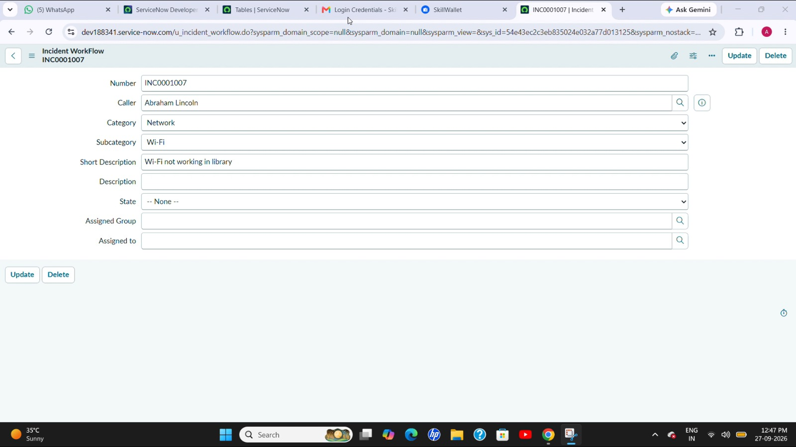
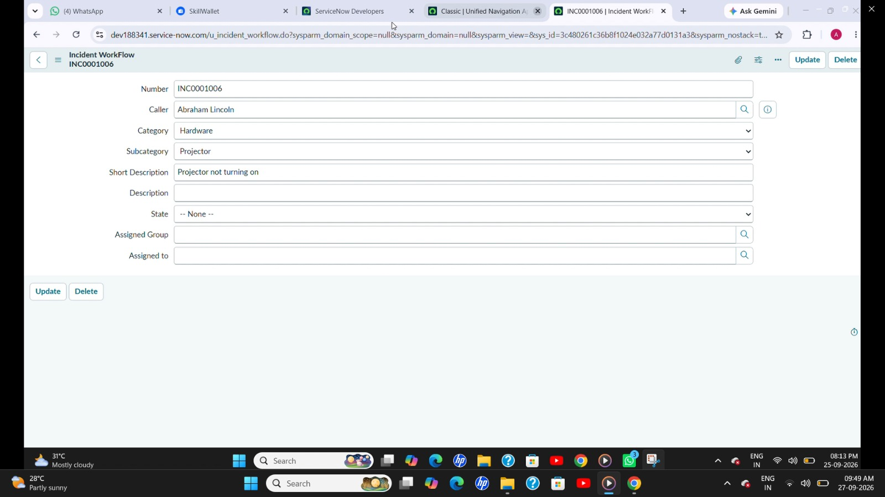

1. Project Title
Auto Ticket Classification using Flow Designer
2. Testing Objective
Testing is performed to verify that newly created IT tickets are classified correctly based on the issue described in the Short Description. It also verifies the Category, Subcategory, and email notification.
3. Test Case 1 – Wi-Fi Issue
Short Description:
WiFi not working in library
Expected Result:
Category: Network
Subcategory: Wi-Fi
Email notification sent to Caller

5. Test Case 2 – Projector Issue
Short Description:
Projector not turning on.
Expected Result:
Category: Hardware
Subcategory: Projector
Email notification sent to Caller

7. Email Notification Testing
After the ticket is created and classified, the email notification can be verified through:
All → Emails → System Logs → Emails
Search for the subject:
Your Request for the issue has been submitted.
Then open the email and use Preview mail.
8. Testing Outcome
The test scenarios verify that the Flow Designer correctly classifies the selected IT tickets and sends the required email notification.
